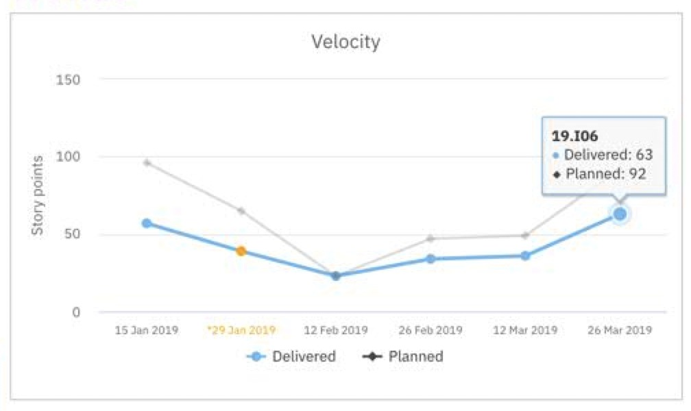
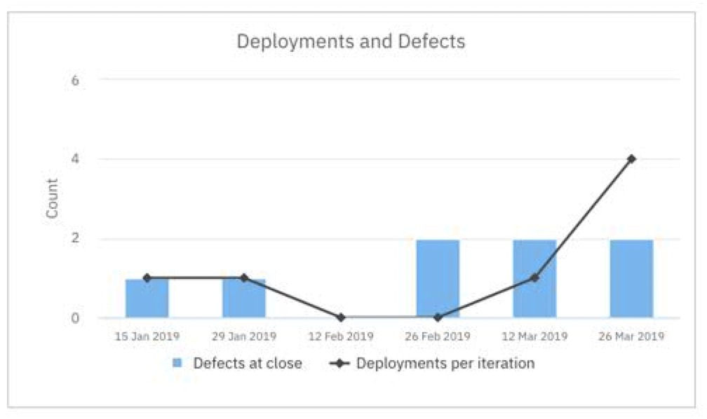
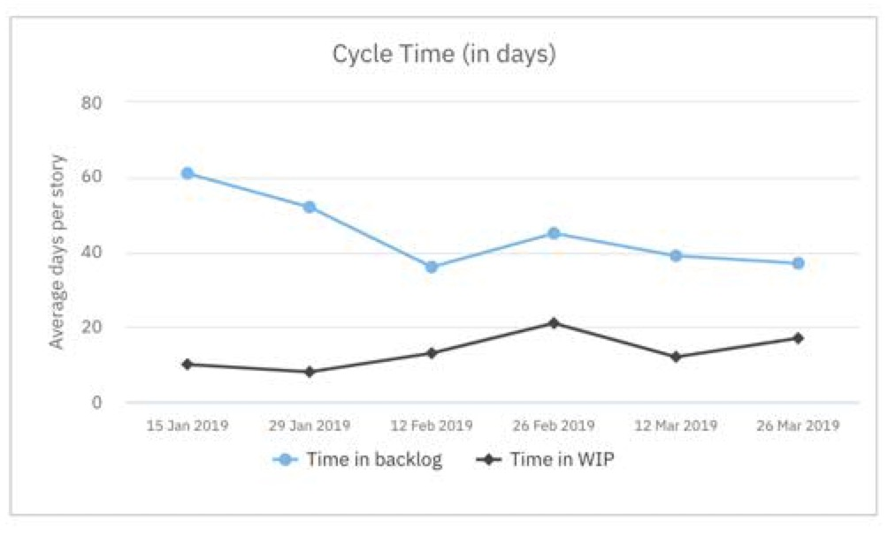
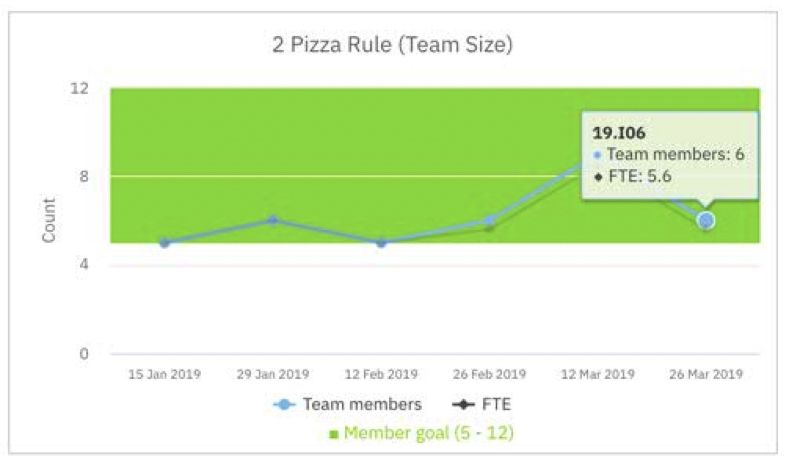
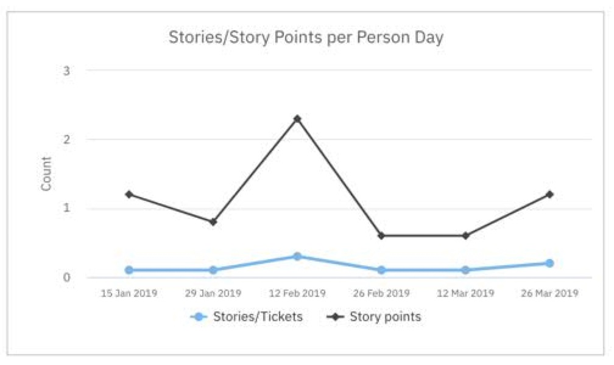
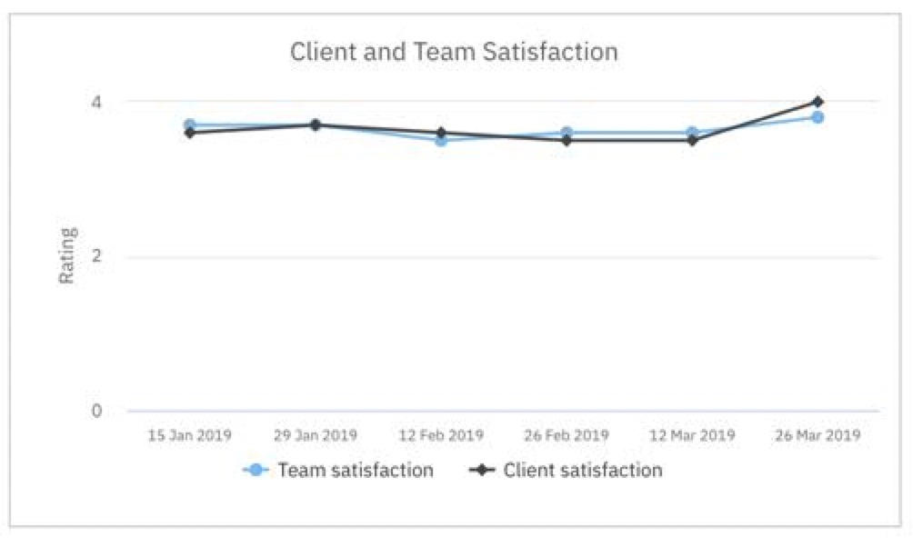
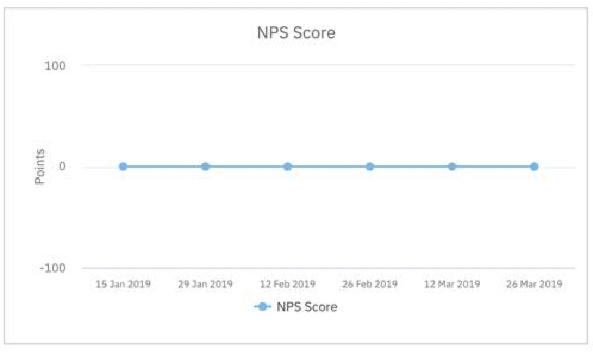
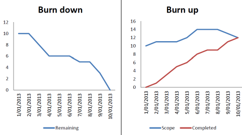
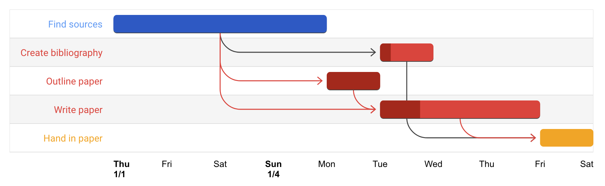

#Velocity图

统计每个iteration的story point，比较delivered和planned的story的区别。

 (velocity.png)

#throughput图

统计每个iteration的story个数，比较delivered和planned的story的区别，和velocity属于不同维度，但是结合velocity能看出story拆分是否合理。

#Deployments and Defect图

侧面反映代码质量问题。

#Cycle Time图

time in backlog和time in WIP的区别，time in backlog能反映是否按优先级来pick up story，time in WIP反映team的速度。

#Team size图

反映员工离职以及休假状态。

#Story/Story points per person day图

用于计算velocity

#Client and Team Satisfaction图

反映客户及团队满意度。

#NPS Score图

The Net Promoter Score is an index ranging from -100 to 100 that measures the willingness of customers to recommend a company’s products or services to others.

#Burn Up/Down图

横轴天数，竖轴story point。
+ Burn Up :  反映每天做完多少story point。
+ Burn Down : 反映每天还剩多少story point没做。

#Road map图：

甘特图

*****

